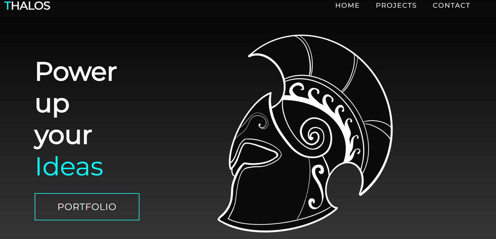

# 🗡️ Thalos Inc

*Short and quick*👋 We are a group on independent developer that get together to test-out the state of art and develop fun projects, along-side professional software products.

> ⚠️All the software made public is intended to be used in our products

  
<h1>Projects</h1>

## Vinted-rs

A complete Vinted API-Wrapper in Rust 🦀

### Stats

  
<h1>📄 License</h1>

Currently, all the code and docs made public are available under the MIT License. Please review the license file inside each project for more details.

We look forward to your contributions and hope you find our projects valuable.

### Thalos Team ⚔️

